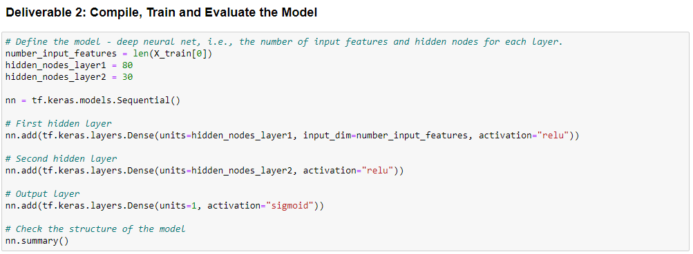
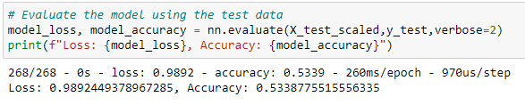
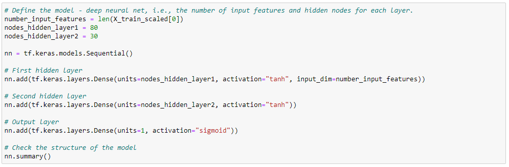
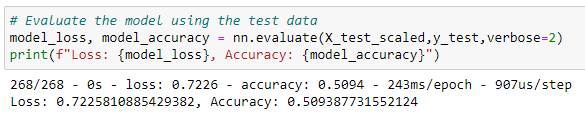
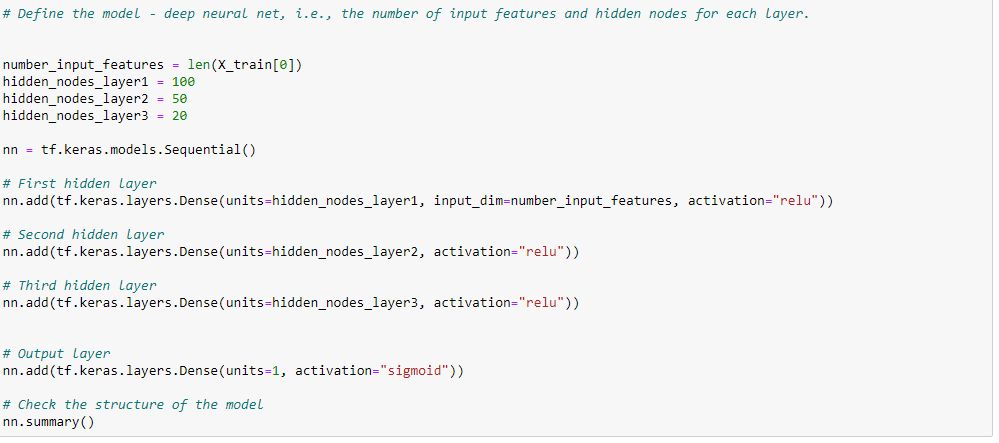

# Neural_Network_Charity_Analysis

## Overview of the analysis
- For this analysis we had a dataset containing various measures on 34,000 organizations that have been funded by Alphabet Soup. This project compromised of the following 3 steps: Preprocessing the data for the neural network, Compile, Train and Evaluate the Model, and Optimizing the model.

## Results 

### Data Preprocessing 

- What variable(s) are considered the target(s) for your model? IS_SUCCESSFUL
- What variable(s) are considered to be the features for your model? All of the columns except for our targer for the model. 
- What variable(s) are neither targets nor features, and should be removed from the input data? Columns such as EIN and Name that were dropped. 

### Compiling, Training and Evaluating the Model

- How many neurons, layers, and activation functions did you select for your neural network model, and why? For this model I used two hidden layers and one output layer. The first hidden layer had 80 nuerons and the second I used 30 nuerons. For both hidden layers we used the relu activation function and sigmoid on the output layer. 

- Were you able to achieve the target model performance? My model was not able to acheive the target score of 75%. I tried running it a few times and the highest performance I acheived was 53%. 

- What steps did you take to try and increase model performance? While trying to optimize the model I attempted to change the activation function of the hidden layer from Relu to tanh and this brought the performance down to 50%. 

I also added in a third hidden layer and added more nuerons to the second hidden layer and this time we achieved a very similar performance of 53%. 

## Summary
- After the initial nueral network and optimization we still did not achieve the performance accuracy score of 75% we could further optimize our model by removing features or adding more data to the dataset to increase the accuracy. Another option would be to use a different machine learning model for testing to see if we could reach a higher accuracy score. 